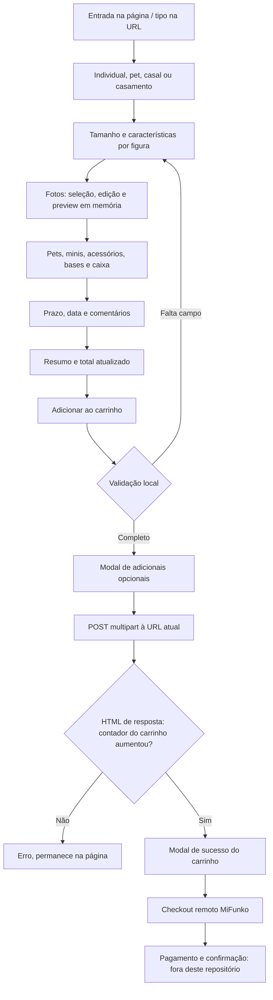

# Jornada, carrinho e finalização

Referências `H` = index original; `P` = product-personalized.js remoto identificado no mapa técnico. Leitura do cliente não comprova processamento no servidor. Nenhum pedido, mensagem, pagamento ou foto foi enviado ao servidor MiFunko na auditoria.

## Fluxo principal

| Etapa | Elementos e funções | Comportamento observado no código |
| --- | --- | --- |
| Entrada | H763–1545, `?tipo=`, P2115–2188/4151–4189 | Individual é selecionado na origem; tipo na URL é lido. Galeria e títulos sincronizam via `mf:funko-type-changed` |
| Escolha | H1248–1345, `selectFunkoType`, `syncFunkoTypeInputs` | Individual, mascota, pareja e boda. Alterar tipo chama `resetFunkoPersonalization`; nomes técnicos seguem em espanhol |
| Personalização | H1559–6371, `applyFunkoTypeLayout`, `createCoupleFlowElements`, `bindCoupleCloneStep` | Tamanho → características; casal/casamento criam segunda figura com nomes `mf_partner_2_*`. Layout é reordenado em runtime |
| Fotografias | H1759/1899/2359/2601+; `mergeFilesIntoAcc`, `syncAccToInput`, `renderUploadThumbs`; editor externo | Escolher arquivo não o envia. Abre editor, gera preview e mantém FileList para envio posterior |
| Adicionais | `setAccessoriesQuantity`, `setLogosQuantity`, `toggleSpecialAccessory`, `refreshPetsUi`, `renderMiniUnitFields` | Mostra campos condicionais, fotos por slot e quantidades. “Família” não é produto próprio ainda |
| Caixa | `mfApplyBoxPricing`, `syncBoxCustomizationVisibility`, `syncBoxDedicationVisibility` | Opções e custo dependem de tamanho/tipo; 20 cm não oferece caixa; personalização paga exige campos próprios |
| Entrega | H6372–6516; `syncShippingUi`, `syncShippingDateFieldState`, `openShippingDatePicker` | Prazo padrão/express, data e flexibilidade. Calendário ajusta mínimo e bloqueia sábados, domingos e segundas; texto adicional é campo de pedido |
| Resumo | H6709–6739 e barra H7500–7540; `updatePersonalizeCtaPrice`, `updateGlobalSummarySelection`, `renderPriceBreakdown` | Preço atualizado no hero, resumo, CTA/barra; detalhamento expansível. Não há prévia de modelo 3D calculada no cliente |
| Botão final da página | H1368 movido para H6731; P6163–6173 | `.single_add_to_cart_button` intercepta click, chama `validateRequiredFields`, destaca passos e abre `showRequiredModal` |
| Validação | P5250–5582 | Campos exigidos por `data-mf-step-nav[data-mf-step-required=true]` e regras explícitas: tipo, tamanho ativo, foto/cabelo/olhos, pele, roupa por figura, fotos de pets selecionados, opção de caixa/dados quando paga, prazo/data |
| Confirmação para carrinho | P5657–5845, `[data-mf-req-add]` | Modal permite corrigir campos ou continuar quando válido; botão chama `submitAddToCart` |
| Envio | P6045–6141 | `new FormData(productForm)`, inclui `add-to-cart=875`, POST `window.location.href`, `credentials:'same-origin'` |
| Resposta | P6080–6123 | Lê HTML com DOMParser, coleta `.woocommerce-error` e exige aumento de `.mf-header__cart-count`. Não se limita a status 200 |
| Sucesso | P5847–5982, `showSuccessModal` | Confirma adição ao carrinho, permite nova personalização/checkout e refresca fragments; **não é confirmação de compra paga** |
| Carrinho | H7424–7499, `cart-drawer.js` | Drawer consulta dados, renderiza itens, altera quantidade, remove ou edita. API deve existir no servidor |
| Checkout e confirmação final | H6660/6709/7484 | Link para `https://mifunko.com/personalizacion/pt/finalizar-compra-2/`. Formulário de endereço/pagamento, criação de pedido, banco, e-mail e página de obrigado não estão no arquivo entregue |

O “esboço 3D grátis” H1404 e H7549 abre `/tumini/pt/` em outro site/serviço. Não existe WebGL, modelo 3D ou processamento de fotos para gerar miniatura no repositório. WhatsApp é uma saída de atendimento, sem montagem de mensagem contendo a configuração.

## Contrato do POST do configurador

O form original H1349 declara action para a página de produto MiFunko e multipart. **O caminho JavaScript normal usa a URL da página aberta, não `form.action`.** Em localhost, portanto, tenta POST no servidor estático local; faltam os handlers WooCommerce/PHP. Se JS não inicializar, o submit nativo do form pode seguir a action externa com campos incompletos. P7789 cancela submit nativo na inicialização bem-sucedida.

São enviados os controles bem-sucedidos associados ao ID do form: campos com `name`, habilitados; radios/checkboxes selecionados; arquivos presentes. `hidden` visual não elimina automaticamente um campo: `disabled` e associação de form importam. Contrato estático completo: [FORM-FIELDS](FORM-FIELDS.md).

| Grupo | Chaves / conteúdo |
| --- | --- |
| WooCommerce | `quantity` (inicial 1), `add-to-cart` (875), `gtmkit_product_data` (metadados de analytics) |
| Modelo | `mf_funko_type`, `mf_funko_type_price` criados em P1085–1100 |
| Características | `mf_size_option`, `mf_face_option`, `mf_skin_option`, `mf_eyes_option`, campos de cores/detalhes, óculos e `mf_mouth_option` |
| Fotos humanas | `mf_face_photo_upload[]`, `mf_outfit_photo_upload[]`, `mf_face_glasses_upload`; **bytes de File** em multipart |
| Segunda figura | Campos renomeados para `mf_partner_2_` + sufixo original; divisores usam nomes da primeira/segunda figura |
| Pets | `mf_pets_option`; `mf_pet_1/2/3_*` (tipo/raça/tamanho/preço/fotos); produto pet usa `mf_pet_type`, `mf_pet_photo[]`, `mf_pet_eyes` e correlatos |
| Acessórios/logos | `mf_accessories_quantity`, `mf_logos_quantity`, `mf_extras_tab`; campos dinâmicos `mf_accessory_detail_N`/`mf_accessory_upload_N` e `mf_logo_detail_N`/`mf_logo_upload_N`; clones com `mf_partner_2_`; `mf_special_accessories[]`, `mf_special_accessory_upload_<slug>`, fotos extras/detalhes por slug e `mf_special_other_*` |
| Minis | `mf_mini_option`, `mf_mini_size_option` e campos dinâmicos por mini (`mf_mini_unit_*`) |
| Bases | `mf_extra_option[]`, `mf_extra_text_data`, correspondentes legados de pet |
| Caixa | `mf_box_option`, `mf_box_character_name`, `mf_box_number`, `mf_box_collection_name`, cor, `mf_box_dedication_enabled/text/image` |
| Entrega | `mf_shipping_option`, `mf_shipping_date`, `mf_shipping_flexible_date`, `mf_instructions_text` |
| Edição | `mf_edit_replace_key` adicionado quando `_mfEditCartKey` existe; campos `mf_existing_*` guardam URLs de imagens já associadas ao item |

Esses nomes identificam o contrato do cliente; não foi fornecido PHP para comprovar saneamento, recálculo, persistência ou o vínculo final com o pedido. Nenhum exemplo contém fotos reais, nonces ou chaves de carrinho.

Apesar dos nomes, `syncAccessoryDetailsTextarea` P4330 e `syncLogoDetailsTextarea` P4491 são stubs sem serialização nesta versão. Os detalhes são inputs individuais criados por `createScopedUploadField`; não existe campo agregado `mf_accessories_details`/`mf_logos_details` no payload atual. Preservar os stubs até revisar leitores/plugins, sem remover por aparência.

## Carrinho e edição

`cart-drawer.js` usa POST multipart para `mfPersonalizedConfig.ajaxUrl` (`/personalizacion/wp-admin/admin-ajax.php`):

| Função / linha no script | action | Outros campos |
| --- | --- | --- |
| `loadCart` 58–89 | `mf_cart_drawer_data` | `nonce` (valor omitido) |
| `removeItem` 219–236 | `mf_cart_remove_item` | `nonce`, `key` |
| `updateQty` 239–251 | `mf_cart_update_qty` | `nonce`, `key`, `quantity` |
| `editFunko` 266–291 | Não envia diretamente | Grava `item.edit_values` em `sessionStorage.mf_edit_config`, recarrega/navega para `item.product_url` |

O restaurador P7930–8694 lê e remove a chave da sessionStorage; recupera opções e URLs de imagens, marca `data-mf-has-existing=1`, cria inputs hidden e prepara `_mfEditCartKey`. Não recupera bytes de arquivos locais perdidos.

Ao atualizar, P6068 envia a chave antiga para substituir, adiciona o novo item e depois remove o antigo por AJAX. P6131–6132 chama `afterAdd` mesmo se remover falhar: **há risco de duplicação e confirmação ambígua de atualização**. O cliente não garante atomicidade.

## Upsell separado

H6526–6563 apresenta um produto adicional de 20 €. O modal H6565–6637 coleta origem da imagem (esboço/upload), arquivo e texto. `gift-upsell.js` 265–276 só verifica existência do arquivo quando necessário e chama `addToCart`. A função 147–186 faz **GET na URL `data-add-to-cart-url`**, sem corpo/FormData/serialização de foto ou texto. Aceita qualquer resposta 2xx como sucesso e emite `mf:gift-upsell:added`/`mf:cart:open`. É uma falha funcional do fluxo atual; não foi alterada.

## Pagamento, banco e comunicação

- PayPal Commerce está configurado no cliente H7708–7712, moeda EUR, intenção capture; CSS de Redsys também é carregado. Isso não comprova credenciais válidas, métodos disponíveis no checkout nem liquidação.
- Não existem servidor, SQL, migrações, banco local, endpoint de criação de pedido ou integração de e-mail no repositório. O sistema de origem aparenta usar WooCommerce; tabelas e retenção não foram auditadas.
- Não há checkout WhatsApp nem mensagem automática de pedido. Os links abrem atendimento espanhol. Nenhuma mensagem foi enviada.
- Cookies WooCommerce/plugins, storage de edição e analytics não equivalem a armazenamento durável de rascunho ou fotos. Ver UPLOAD-AUDIT e INTEGRATIONS.
